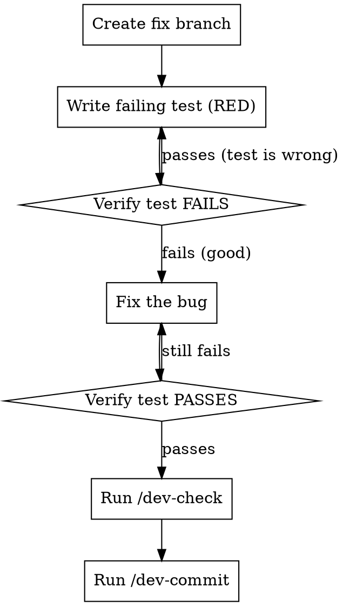

# Bug Workflow

## Overview

Report, track, fix, close. Every bug gets documented.

**Core principle:** A bug without a paper trail will be found twice.

## Severity Levels

| Level | Meaning | Response |
|-------|---------|----------|
| **P0** | System down or data loss | Fix immediately. Drop everything. |
| **P1** | Feature broken, workaround exists | Fix this version. |
| **P2** | Minor, cosmetic, edge case | Schedule for next version. |

If severity not provided, assess from context. When in doubt, err toward higher severity.

## Step 1: Report

Add unchecked item to `docs/bugs.md`:

```markdown
- [ ] [P1] Agent session leaks on timeout — cleanup handler not called when SDK times out. (YYYY-MM-DD)
```

Format: `- [ ] [P<N>] <title> — <one-line description>. (<date>)`

## Step 2: Track

Add entry to `ROADMAP.md` Bugs section with target version:

```markdown
- [ ] BUG-XXX: <title> [P<N>] -> vX.Y.Z
```

## Step 3: Fix



1. `git checkout -b fix/<kebab-description>`
2. Write a test that reproduces the bug FIRST — use `superpowers:test-driven-development`
3. Verify the test FAILS (proves it catches the bug)
4. Fix the bug
5. Verify the test PASSES
6. Run `/dev-check`
7. Run `/dev-commit` with footer `Fixes: BUG-XXX`

**The regression test is non-negotiable.** If you can't reproduce it in a test, use `superpowers:systematic-debugging` to understand the root cause first.

## Step 4: Close

After merging:
1. Check off in `docs/bugs.md`: `- [x] [P1] ...`
2. Add to Fix Log table (if one exists)
3. Update CHANGELOG.md
4. Update ROADMAP.md status

## Cascade

- Root cause unclear → `superpowers:systematic-debugging`
- Writing the fix → `superpowers:test-driven-development`
- Before commit → `/dev-check`
- To commit → `/dev-commit`
- Merging → `/dev-finish`
- Releasing hotfix → `/dev-ship`

**All dev skills:** `~/.claude/skills/dev-*` — run `/dev-teach` to set up a new project.
