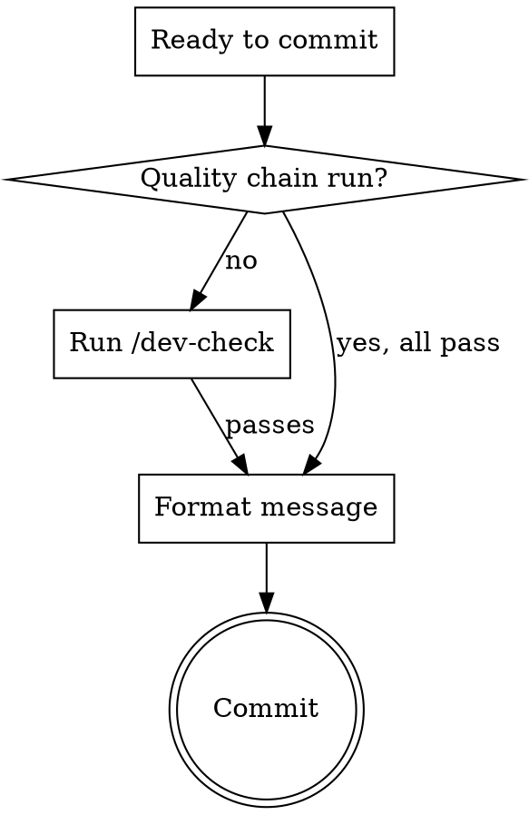

# Commit

## Overview

One logical change per commit. Properly formatted. Quality-verified.

**Core principle:** Every commit tells a clear story. The message explains WHAT changed and WHY.

## Pre-Commit Gate



If `/dev-check` hasn't been run on the current changes, run it now. Never use `--no-verify`.

## Conventional Commit Format

```
<type>(<scope>): <description>

[optional body]

[optional footer]
```

### Types

`feat`, `fix`, `refactor`, `docs`, `test`, `chore`, `perf`

### Scopes

Read from project's `CLAUDE.md` or `ref/workflow.md` for the scope list. If no scope list exists, derive from directory structure.

### Rules

- **Imperative mood:** "add feature" not "added feature"
- **Lowercase:** description starts lowercase
- **No period:** no trailing period on subject line
- **One change:** if you need "and" in the description, probably two commits
- **Body for WHY:** subject says WHAT, body says WHY (when non-obvious)
- **Footer for refs:** `Fixes: BUG-003` or `Closes: #42`

### Examples

```
feat(memory): add TTL-based memory expiration

Memories older than their TTL are excluded from recall queries.
FTS5 index remains intact; expiration filters at query time.
```

```
fix(agent-runner): prevent session leak on timeout paths

Cleanup handler wasn't called when Claude SDK timed out.
Added finally block to ensure session.close() always runs.

Fixes: BUG-012
```

```
refactor(coordination): extract task validation into shared util

No behavior change. Deduplicates validation logic across
3 coordination functions.
```

## Commit Discipline

Before committing, verify:

- [ ] One logical change (no mixing features with refactors)
- [ ] Imperative mood, lowercase, no trailing period
- [ ] Scope matches the area of code changed
- [ ] Body explains WHY if the change isn't obvious
- [ ] If > 5 files changed, consider splitting

### Split Signals

If any of these are true, split into multiple commits:
- You need "and" in the description
- Changes span unrelated modules
- You could revert one part but not the other
- The diff tells two stories

## Execute

```bash
git add -A  # or stage specific files if splitting
git commit -m "<type>(<scope>): <description>"
```

For commits with body:
```bash
git commit -m "<type>(<scope>): <description>" -m "<body>" -m "<footer>"
```

## Cascade

**Next:**
- More work to do → continue implementing, `/dev-check` before next commit
- Feature/fix complete → `/dev-finish`
- Ready to release → `/dev-ship`
- Fixed a bug → close it in `docs/bugs.md`, update CHANGELOG

**All dev skills:** `~/.claude/skills/dev-*` — run `/dev-teach` to set up a new project.
