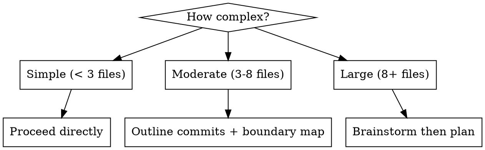

# Start New Work

## Overview

Set up properly before writing code. Good starts prevent bad commits.

**Core principle:** Context before code. Branch before edits. Plan before implementation.

## The Process

### Step 0: Check for Continue-Here

Before anything else, check if `.continue-here.md` exists at the project root. If it does:

1. Read it — it contains state from a previous session (completed work, remaining tasks, decisions made, next action)
2. State what was already done and what's next
3. Delete the file after loading (it's ephemeral, consumed on resume)
4. Skip to the step indicated by the continue-here file

If no continue-here file, proceed normally.

### Step 1: Determine Work Type

If not provided as argument, identify from context:

| Type | When | Example Branch |
|------|------|---------------|
| `feat` | New functionality | `feat/memory-ttl` |
| `fix` | Bug repair | `fix/session-leak-on-timeout` |
| `refactor` | Restructure, no behavior change | `refactor/extract-task-validation` |
| `docs` | Documentation only | `docs/update-roadmap-phase-14` |
| `test` | Test additions/fixes | `test/whatsapp-message-chunking` |
| `chore` | Maintenance, deps, config | `chore/bump-version-0.4.0` |
| `perf` | Performance improvement | `perf/batch-memory-writes` |

### Step 2: Create Branch

```bash
git checkout main
git pull
git checkout -b <type>/<kebab-case-description>
```

Trunk-based development. Short-lived branches (1-3 days max). Merge back quickly.

### Step 3: Load Context (Precise)

Don't read entire files. Grep for relevant entries, then read only matching sections:

```bash
grep -n "<feature-or-bug-keywords>" ROADMAP.md CHANGELOG.md docs/bugs.md
```

Load only the relevant lines/sections. Large files in full = context waste.

State the target version and any related work items.

### Step 4: Don't Hand-Roll

Before implementing anything, search for existing solutions:

1. **Codebase search** — grep for similar patterns, utilities, helpers. Does this already exist somewhere?
2. **Dependencies** — does an installed package already solve this? Check `package.json` / `node_modules`.
3. **Standard library** — is there a built-in Node.js or language feature for this?

If something exists, use it. Don't rewrite it. State what you found (or didn't find).

### Step 5: Discuss Gray Areas

For features and complex fixes, identify decisions with multiple reasonable approaches. Interview the user about each one before coding:

- "Should memory TTL be per-agent or global?" — concrete options, not open-ended
- "The scheduler could retry failed tasks or skip them — which?" — force a choice
- Challenge vague answers ("make it simple" → "simple means what? Fewer config options? Fewer lines? Fewer edge cases handled?")

Record decisions in the commit body later. This prevents re-debate in future sessions.

**Skip this step for:** trivial fixes, doc changes, test additions, clear-cut refactors.

### Step 6: Assess Complexity



- **Simple:** Proceed to implementation.
- **Moderate:** Outline commits. Write a boundary map (see below).
- **Large:** Use `superpowers:brainstorming` first, then `superpowers:writing-plans`.

### Boundary Maps (Moderate+ Only)

Before implementing, declare what the work produces and consumes:

```markdown
## Boundary Map: <feature-name>

### Produces
- `recallWithTTL(agentName, query, opts)` → MemoryResult[] (engine/memory-engine.ts)
- `ttl` field in MemoryRecord type (src/types.ts)

### Consumes
- `db.memories` table (existing)
- `agentConfig.memoryTTL` from agents.yaml (new field)

### Changes to Existing Interfaces
- MemoryRecord gains optional `ttl?: number`
- recall() gains optional `maxAge?: number` parameter
```

This prevents silent assumptions about what's available and catches interface mismatches before coding.

### Step 7: Confirm Start

State:
- Branch name
- What you're building/fixing
- Target version (from ROADMAP)
- Don't-hand-roll findings
- Key decisions from gray area discussion
- Complexity assessment and approach
- Boundary map (if moderate+)

Then proceed to implementation.

## During Implementation

- `/proving-correctness` gates apply: pushback before implementing (Gate 1), inline checkpoints after each function (Gate 2)
- For bugs: use `superpowers:systematic-debugging` to find root cause first
- For features: use `superpowers:test-driven-development` — write tests alongside implementation

## Cascade

**Next:** Implement, then `/dev-check` before committing. If ending the session mid-work, run `/dev-pause`.

**All dev skills:** `~/.claude/skills/dev-*` — run `/dev-teach` to set up a new project.
