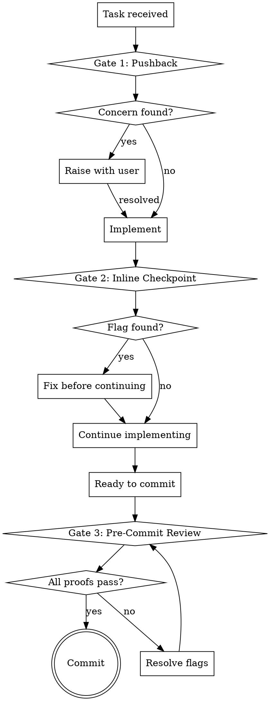

# Proving Correctness

## Overview

LLMs write plausible code, not correct code. Code that compiles and passes tests can still be 20,000x slower than it should be, over-engineered by orders of magnitude, or built on unchallenged wrong assumptions. This skill forces proof at every stage.

**Core principle:** The burden of proof is on the code. "It works" is not proof.

**Violating the letter of these rules is violating the spirit of these rules.**

## When to Use

- Before implementing any feature or significant code change (pushback)
- After writing each non-trivial function, module, or config change (inline checkpoint)
- Before committing (pre-commit review)
- Run `/proving-correctness teach` once per project to build project-specific context

## The Three Gates



## Gate 1: Structured Pushback (Anti-Sycophancy)

Before implementing, produce a pushback block:

- **Simpler alternative?** — Could a one-liner, existing library, or config change replace this?
- **Assumption challenge:** — What assumption in the request might be wrong?
- **Scope check:** — Is this the minimum change needed?

Real concerns must be raised before implementing. This is NOT a rubber stamp.

## Gate 2: Inline Correctness Checkpoint

After writing each non-trivial function, module, or config change, answer five questions:

1. What's the **time complexity**? Could it be better?
2. What **I/O** does this do per call?
3. Does this **allocate** where it could reuse?
4. If this runs **10,000 times**, what breaks?
5. Can I state **WHY** this approach, not just what it does?

**Scope:** All production logic and config. Only exempt: type definitions, test files, docs.

See `correctness-questions.md` for the full reference including config-specific questions.

## Gate 3: Pre-Commit Review

Run alongside `/simplify`. For each changed file, provide three proofs:

1. **Prove correct** — explain WHY, not just that it compiles
2. **Prove not over-engineered** — could something simpler work?
3. **Prove performance acceptable** — state expected cost for I/O and iteration

Output per-file verdicts. Flags must resolve (fix, measure, or explicitly accept) before committing.

See `correctness-questions.md` for output format and resolution options.

## Project Context

If `.proving-correctness.md` exists at project root, load it. It contains:
- Hot paths to scrutinize
- Invariants that must hold
- Performance baselines to measure against
- Past failures to avoid repeating

No context file? Work generically. Suggest `/proving-correctness teach` for regular projects.

## Teach Mode

When invoked with `teach` argument OR when `.proving-correctness.md` doesn't exist and user wants to set it up:

### Step 1: Explore the Codebase

Scan for performance-sensitive areas:
- Database queries and access patterns
- I/O operations (network, filesystem, syscalls)
- Loops and iteration over collections
- Concurrency and queuing patterns
- Config files with numeric values (timeouts, pool sizes, thresholds, retry counts)

### Step 2: Ask the User

One question at a time, multiple choice where possible:

- **Hot paths:** Where does performance actually matter in this project?
- **Baselines:** Any known performance expectations? (query times, throughput, latency budgets)
- **Past failures:** What subtle bugs have tests missed before? Performance regressions?
- **Invariants:** What must always be true? (e.g., "one message per agent at a time")

Skip questions already answered by codebase exploration.

### Step 3: Write Context

Write `.proving-correctness.md` to the project root:

```markdown
# Correctness Context: <project-name>

## Hot Paths
- [file references + expected characteristics]

## Known Invariants
- [things that must always be true]

## Performance Baselines
- [measurable expectations]

## Past Failures
- [what went wrong, so we don't repeat it]
```

Confirm completion. Context is now active for all future correctness checks in this project.

## Red Flags — STOP

- About to implement without running pushback ("it's straightforward")
- Skipping inline checkpoint ("this function is simple")
- "Tests pass" as proof of correctness
- "Should be fine" about performance
- Implementing exactly what was asked without questioning it
- Adding abstraction "for future flexibility"
- Can't explain WHY the code makes a specific choice

**All of these mean: stop and run the relevant gate.**

## Rationalization Table

| Excuse | Reality |
|--------|---------|
| "This is too simple for pushback" | Simple tasks are where sycophancy hides. Run it. |
| "The user knows what they want" | Your job is correctness, not agreement. Challenge it. |
| "Tests will catch it" | Tests catch behavior, not performance invariants. |
| "I'll optimize later" | Later never comes. State the cost now. |
| "It compiles and works" | The SQLite Rust clone compiled too. 20,000x slower. |
| "Pushback would be annoying here" | Annoyance < shipping wrong code. |
| "This config value looks reasonable" | Reasonable to whom? What happens at 10x? |
| "I can't benchmark in this context" | You can state expected complexity. That's the minimum. |

## The Bottom Line

**Plausible is not correct. Prove it.**
